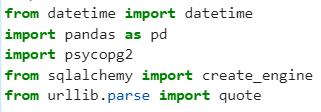

# Supermarket-Cashier
## Welcome to Andi’s Supermarket Cashier Program
The Cashier Program is a system for self-service cashiers that enables them to input items, their prices, and the quantity ordered into a table, and subsequently provides the total amount to be paid.

### Program Flow:
1. Users create a transaction on the program, one transaction at a time.
2. Users add product name, quantity and price in a single input
3. Users might change the product name, quantity and price without affecting each other (they might change the name without the quantities)
4. Users might delete products from the transaction list
5. Users might reset all the transaction and start from the beginning

### Code Explanation
#### 1. Importing Libraries
                                                          

These codes import necessary libraries to make the coding experience easier. Datetime library enables users to generate current date and time of the transaction. Pandas is used to make data tabulation easier. Psycopg2, sqlalchemy and urllib.parse are tools to support data transfer from python to database
