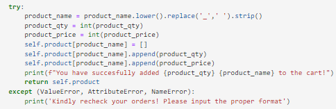

# Supermarket-Cashier
## Welcome to Andi’s Supermarket Cashier Program
The Cashier Program is a system for self-service cashiers that enables them to input items, their prices, and the quantity ordered into a table, and subsequently provides the total amount to be paid.

### Program Flow:
1. Users create a transaction on the program, one transaction at a time.
2. Users add product name, quantity and price in a single input
3. Users might change the product name, quantity and price without affecting each other (they might change the name without the quantities)
4. Users might delete products from the transaction list
5. Users might reset all the transaction and start from the beginning

### Code Explanation
#### 1. Importing Libraries

These codes import necessary libraries to make the coding experience easier. Datetime library enables users to generate current date and time of the transaction. Pandas is used to make data tabulation easier. Psycopg2, sqlalchemy and urllib.parse are tools to support data transfer from python to database

#### 2. Creating object from Transaction Class

This code initialize an object created from ‘Transaction’ class. It prints concurrent number of transaction and the date when the transactions were made.

#### 3. Adding product

‘add_product’ method enables users to add product name with the quantities and price. The inputs of this method are the product name, quantity and price.. These input will be transformed into dictionary 

#### 4. Edit/customize order

There are several method which enable users to edit their order: update_product_name, update_product_qty, update_product_price, delete_product and reset_transaction.

##### update_product_name

Users can input what product to be changed and the new product name in this method. 

update_product_qty

